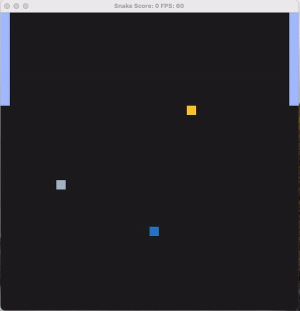

# CPPND: Capstone Snake Game Example

## Some newly added features

## RUBIC points covered
- README (All Rubric Points REQUIRED)
  - A README with instructions is included with the project
  - The README indicates which project is chosen.
    - The project is an snake game with below features as added to it
      - A moving border is added on both sides of window
      - Rule of five code is added
      - A false food feature is added. Eat it also kills the snake
      - Moving border and snake collision kills the snake
    - Files and class structure
      - Files and class structure is same as basic snake game
      - A movingborder class has been added
      - A movingborder_left and movingborder_right is called from the renderer.cpp for update of border location
      - Collision checking and move border is called from the Game::Run method
      - There is also a false food is added in the Game::Run. Collision of false food and snake, also kills the snake
    - Expected behaviour
      - Snake should not collide with moving border, else it will die
      - Snake should not eat false food, else it will die
    - The README includes information about each rubric point addressed
      - A code is added like `LFIO_1`, it can be searched in the project for the rubic points addressed
- Compiling and Testing (All Rubric Points REQUIRED)
  - The submission must compile and run.
    - Please check "Basic Build Instructions" section
    - Also makefile has been added, so calling `make build` and then calling `./Snake_Game` is suffice
    - Also `make clean` will delete the build folder
- Loops, Functions, I/O
  - LFIO_1: The project demonstrates an understanding of C++ functions and control structures.
  - LFIO_3: The project accepts user input and processes the input.
- Object Oriented Programming
  - OOP_1: The project uses Object Oriented Programming techniques.
  - OOP_2: Classes use appropriate access specifiers for class members.
  - OOP_3: Class constructors utilize member initialization lists.
  - OOP_5: Classes encapsulate behavior.
  - OOP_7: Overloaded functions allow the same function to operate on different parameters.
- Memory Management
  - MM_1: The project makes use of references in function declarations.
  - MM_4: The project follows the Rule of 5

## Dependencies for Running Locally
* cmake >= 3.7
  * All OSes: [click here for installation instructions](https://cmake.org/install/)
* make >= 4.1 (Linux, Mac), 3.81 (Windows)
  * Linux: make is installed by default on most Linux distros
  * Mac: [install Xcode command line tools to get make](https://developer.apple.com/xcode/features/)
  * Windows: [Click here for installation instructions](http://gnuwin32.sourceforge.net/packages/make.htm)
* SDL2 >= 2.0
  * All installation instructions can be found [here](https://wiki.libsdl.org/Installation)
  >Note that for Linux, an `apt` or `apt-get` installation is preferred to building from source. 
* gcc/g++ >= 5.4
  * Linux: gcc / g++ is installed by default on most Linux distros
  * Mac: same deal as make - [install Xcode command line tools](https://developer.apple.com/xcode/features/)
  * Windows: recommend using [MinGW](http://www.mingw.org/)

## Basic Build Instructions

1. Clone this repo.
2. Make a build directory in the top level directory: `mkdir build && cd build`
3. Compile: `cmake .. && make`
4. Run it: `./SnakeGame`.

## CC Attribution-ShareAlike 4.0 International

Shield: [![CC BY-SA 4.0][cc-by-sa-shield]][cc-by-sa]

This work is licensed under a
[Creative Commons Attribution-ShareAlike 4.0 International License][cc-by-sa].

[![CC BY-SA 4.0][cc-by-sa-image]][cc-by-sa]

[cc-by-sa]: http://creativecommons.org/licenses/by-sa/4.0/
[cc-by-sa-image]: https://licensebuttons.net/l/by-sa/4.0/88x31.png
[cc-by-sa-shield]: https://img.shields.io/badge/License-CC%20BY--SA%204.0-lightgrey.svg
